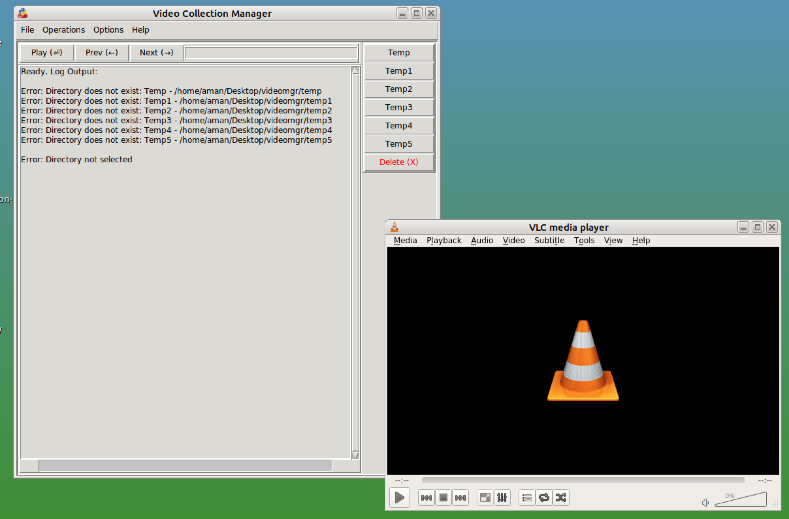

# Video Collection Manager
 Application to manage huge video collection

 This App will allow you to:
 - Play Video files one by one from a Directory.
 - Move selected Video to a selected Directory from a list.
 - Delete selected Video file.
 - Delete All files from a directory.
 - Display Stats about the operations.
 - Manage the list of Directories to move the files.

Pending Actions List:
 - Integrate VLC Window in the Main program window

Dependencies:
 - sudo pip3 install psutil --break-system-packages
